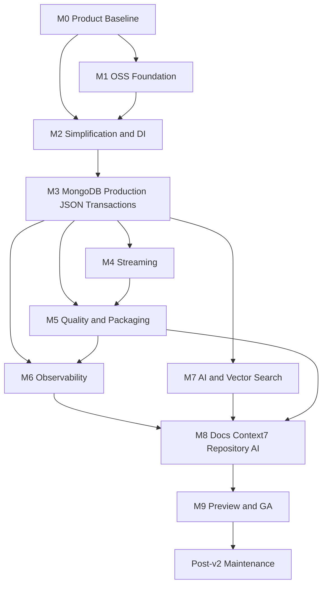

# Professional Open-Source v2 Roadmap

Canonical tracking for Dilcore DocumentDB / MongoDB toolkit v2.  
This document is the product roadmap. Implementation work is tracked as GitHub issues under the milestones below.

**Repository:** [aytymchuk/Dilcore-Library-DocumentDb](https://github.com/aytymchuk/Dilcore-Library-DocumentDb)  
**Issues filter:** [label:roadmap](https://github.com/aytymchuk/Dilcore-Library-DocumentDb/issues?q=is%3Aissue+label%3Aroadmap)  
**GitHub Project:** see [GitHub tracking](#github-tracking)  
**Status:** Planning artifacts only — source, tests, and workflows remain unchanged until milestone issues are executed.

---

## Product definition

### Clear value

Position the library as an **opinionated MongoDB application toolkit**, not a replacement for `MongoDB.Driver` and not a database-agnostic repository:

- Safe, validated multi-cluster / multi-database DI with runtime tenant-aware namespace resolution.
- Reusable document policies: optimistic concurrency, audit timestamps, optional soft delete, and typed failures.
- Declarative, idempotent collection / schema / index provisioning outside request hot paths.
- First-class dynamic and typed JSON interchange through System.Text.Json and Newtonsoft.Json without bypassing database / collection resolution.
- Explicit multi-document transaction coordination with bounded client-side budgets, plus independent finite-query and change-stream APIs.
- Production defaults and diagnostics through .NET logging, tracing, metrics, readiness, and MongoDB driver events.
- AI-ready integration through native MongoDB Vector Search and standard .NET embedding / vector abstractions.
- Direct `IMongoClient`, `IMongoDatabase`, and `IMongoCollection<T>` escape hatches for all driver capabilities.

This is better than repeating those cross-cutting policies in every service. It is **not** better for a simple application that only needs one client and a few direct collection calls.

### Explicit non-goals

- Do not reimplement connection pooling, retryable reads/writes, concerns, transaction retry semantics, cursor protocols, aggregation, GridFS, encryption, or exporters already supplied by MongoDB / .NET ecosystems. Transaction and streaming features must remain thin, explicit coordination layers over driver sessions / cursors.
- Do not hide MongoDB query types behind a lowest-common-denominator data abstraction.
- Do not add Azure Monitor, Application Insights, AWS, ADOT, CloudWatch, OpenAI, or other vendor SDKs to core packages.
- Do not promise provider neutrality while MongoDB is the only backend. An ADR must either rename packages toward `Dilcore.MongoDB` or justify `DocumentDb` with a real second provider, and must account for confusion with Amazon DocumentDB.

### Design principles

- Thin integration over `MongoDB.Driver`; advanced features remain directly reachable.
- Startup configuration is immutable and validated; request / tenant namespace resolution is scoped and fail-closed.
- Singleton `IMongoClient` per unique cluster settings; lightweight database / collection handles use appropriate scoped or singleton lifetimes.
- Optional policies are expressed through composable interfaces rather than one mandatory entity shape.
- JSON adapters share one conversion contract, preserve BSON types through Extended JSON or explicit conversion profiles, and use the same named binding / namespace resolver pipeline as typed documents.
- Transaction state and cursor ownership are explicit; no ambient session, hidden transaction, parallel transaction operation, silent atomicity-breaking chunk, or undisposed cursor.
- Telemetry is passive, opt-in, exporter-neutral, redacted, and low-cardinality.
- No side effects such as convention or index registration occur during ordinary collection resolution.

---

## Milestone dependency graph

**Release gates**

| Gate | Blocks | Criteria |
|------|--------|----------|
| Decisions | Package / API implementation | M0/M1 naming, SemVer, license, Dependabot, Serena baseline |
| Preview | `2.0.0-alpha` | Correctness, DI isolation, JSON fidelity, transaction safety, cursor lifecycle |
| GA | `2.0.0` | All M2–M8 exit criteria, Context7, skill, samples, migration docs |

---

## Milestones

### M0 — Product baseline and decisions

Milestone: [M0 Product Baseline](https://github.com/aytymchuk/Dilcore-Library-DocumentDb/milestone/1)

| Issue | Work | Priority |
|-------|------|----------|
| [#2](https://github.com/aytymchuk/Dilcore-Library-DocumentDb/issues/2) | Inventory public API and four-package graph; create API compatibility baseline | P0 |
| [#3](https://github.com/aytymchuk/Dilcore-Library-DocumentDb/issues/3) | Record defects and incorrect positioning claims to correct in v2 | P0 |
| [#4](https://github.com/aytymchuk/Dilcore-Library-DocumentDb/issues/4) | ADR: package naming (`Dilcore.MongoDB` vs `DocumentDb`), reserved NuGet IDs | P0 |
| [#5](https://github.com/aytymchuk/Dilcore-Library-DocumentDb/issues/5) | Decide TFMs, MongoDB server/driver matrix, SemVer, deprecation, migration policy | P0 |
| [#6](https://github.com/aytymchuk/Dilcore-Library-DocumentDb/issues/6) | Establish measurable goals (packages, deps, cold-start, telemetry overhead, coverage, docs) | P1 |
| [#7](https://github.com/aytymchuk/Dilcore-Library-DocumentDb/issues/7) | Validate Serena `.serena/project.yml`, onboarding, and focused memories | P1 |
| [#46](https://github.com/aytymchuk/Dilcore-Library-DocumentDb/issues/46) | Roadmap cross-link and coverage verification | P0 |

**Exit criteria:** Naming ADR accepted; supported matrix published; API baseline captured; Serena memories committed (local overrides remain untracked).

### M1 — Open-source trust foundation

Milestone: [M1 OSS Foundation](https://github.com/aytymchuk/Dilcore-Library-DocumentDb/milestone/2)

| Issue | Work | Priority |
|-------|------|----------|
| [#8](https://github.com/aytymchuk/Dilcore-Library-DocumentDb/issues/8) | MIT license text + CONTRIBUTING, CoC, SECURITY, SUPPORT, GOVERNANCE, CHANGELOG | P0 |
| [#9](https://github.com/aytymchuk/Dilcore-Library-DocumentDb/issues/9) | Issue/PR templates, CODEOWNERS, Discussions policy, branch rulesets with CI required | P0 |
| [#10](https://github.com/aytymchuk/Dilcore-Library-DocumentDb/issues/10) | Dependabot for NuGet and GitHub Actions (weekly, bounded PRs, conservative grouping) | P0 |
| [#11](https://github.com/aytymchuk/Dilcore-Library-DocumentDb/issues/11) | Dependency review, CodeQL, Scorecard, SHA-pinned actions, workflow YAML validation | P0 |

**Exit criteria:** Trust docs landed; Dependabot validates for both ecosystems; security workflows green; CI is a required check.

### M2 — Simplify packages and redesign DI

Milestone: [M2 Simplification & DI](https://github.com/aytymchuk/Dilcore-Library-DocumentDb/milestone/3)

| Issue | Work | Priority |
|-------|------|----------|
| [#12](https://github.com/aytymchuk/Dilcore-Library-DocumentDb/issues/12) | Package topology: primary package + optional JSON/OTEL/Vector/policy integrations | P0 |
| [#13](https://github.com/aytymchuk/Dilcore-Library-DocumentDb/issues/13) | Remove dead APIs, redundant packages, FluentValidation single-guard usage | P0 |
| [#14](https://github.com/aytymchuk/Dilcore-Library-DocumentDb/issues/14) | Named/typed cluster, database, document bindings; multi-cluster singleton clients | P0 |
| [#15](https://github.com/aytymchuk/Dilcore-Library-DocumentDb/issues/15) | Scoped namespace-resolution pipeline; tenant fail-closed policies | P0 |
| [#16](https://github.com/aytymchuk/Dilcore-Library-DocumentDb/issues/16) | External client ownership; keyed/typed driver escape hatches | P1 |
| [#17](https://github.com/aytymchuk/Dilcore-Library-DocumentDb/issues/17) | DI acceptance tests (clusters, same-type bindings, tenants, resolver order, v1 parity) | P0 |

**Exit criteria:** No unkeyed same-type collisions; duplicate registrations fail at startup; JSON and typed APIs share one resolver path; DI suite green.

### M3 — MongoDB production, JSON, and transactions

Milestone: [M3 MongoDB Production, JSON & Transactions](https://github.com/aytymchuk/Dilcore-Library-DocumentDb/milestone/4)

| Issue | Work | Priority |
|-------|------|----------|
| [#18](https://github.com/aytymchuk/Dilcore-Library-DocumentDb/issues/18) | Fix latent correctness bugs (soft-delete, ETag, mutation, replace/patch, bulk) | P0 |
| [#19](https://github.com/aytymchuk/Dilcore-Library-DocumentDb/issues/19) | Production query/policy capabilities (keyset pagination, restore/purge, typed failures) | P1 |
| [#20](https://github.com/aytymchuk/Dilcore-Library-DocumentDb/issues/20) | JSON interoperability: STJ + Newtonsoft, Extended JSON fidelity, conversion profiles | P0 |
| [#21](https://github.com/aytymchuk/Dilcore-Library-DocumentDb/issues/21) | Multi-document transactions via `WithTransactionAsync` + client budget guardrails | P0 |
| [#22](https://github.com/aytymchuk/Dilcore-Library-DocumentDb/issues/22) | Idempotent provisioning / migration runner (indexes, TTL, vector, schema validation) | P0 |
| [#23](https://github.com/aytymchuk/Dilcore-Library-DocumentDb/issues/23) | Replica-set integration matrix + production security guidance | P0 |

**Exit criteria:** Soft-delete/concurrency/bulk correct; both JSON stacks round-trip with type fidelity; transactions never silently chunk; budgets are estimates (no false “16 MiB total transaction” claim); provisioning is outside request hot paths.

### M4 — Streaming as an independent feature

Milestone: [M4 Streaming](https://github.com/aytymchuk/Dilcore-Library-DocumentDb/milestone/5)

| Issue | Work | Priority |
|-------|------|----------|
| [#24](https://github.com/aytymchuk/Dilcore-Library-DocumentDb/issues/24) | Streaming surface design (separate namespace/opt-in; package only if justified) | P0 |
| [#25](https://github.com/aytymchuk/Dilcore-Library-DocumentDb/issues/25) | Finite query streaming (`IAsyncEnumerable<T>`, disposal, backpressure) | P0 |
| [#26](https://github.com/aytymchuk/Dilcore-Library-DocumentDb/issues/26) | Change streams (resume tokens, checkpoints, at-least-once docs) | P0 |
| [#27](https://github.com/aytymchuk/Dilcore-Library-DocumentDb/issues/27) | Streaming tests + bounded lifecycle telemetry hooks | P1 |

**Exit criteria:** Finite and change streams are non-interchangeable; every enumeration owns/disposes one cursor; no unbounded buffering or infinite auto-retry; same resolver pipeline as CRUD/JSON.

### M5 — Quality, compatibility, and packaging

Milestone: [M5 Quality & Packaging](https://github.com/aytymchuk/Dilcore-Library-DocumentDb/milestone/6)

| Issue | Work | Priority |
|-------|------|----------|
| [#28](https://github.com/aytymchuk/Dilcore-Library-DocumentDb/issues/28) | `global.json`, `.editorconfig`, analyzers, XML docs, warnings-as-errors, format gate | P0 |
| [#29](https://github.com/aytymchuk/Dilcore-Library-DocumentDb/issues/29) | Consolidate tests on NUnit + Shouldly; expand unit/integration/public-API suites | P0 |
| [#30](https://github.com/aytymchuk/Dilcore-Library-DocumentDb/issues/30) | Package validation, Source Link, symbols, OIDC NuGet publish, GitHub Releases | P0 |
| [#31](https://github.com/aytymchuk/Dilcore-Library-DocumentDb/issues/31) | Benchmarks: driver vs policy, DI, JSON, transactions, streaming, telemetry overhead | P1 |

**Exit criteria:** Deterministic builds; package validation green; main-branch auto-publish removed; Shouldly remains the assertion library.

### M6 — Exporter-neutral observability

Milestone: [M6 Observability](https://github.com/aytymchuk/Dilcore-Library-DocumentDb/milestone/7)

| Issue | Work | Priority |
|-------|------|----------|
| [#32](https://github.com/aytymchuk/Dilcore-Library-DocumentDb/issues/32) | Upgrade MongoDB.Driver (3.7+ ActivitySource; validate current release) | P0 |
| [#33](https://github.com/aytymchuk/Dilcore-Library-DocumentDb/issues/33) | Core OTEL: `ILogger` / `ActivitySource` / `Meter`; no exporter dependencies | P0 |
| [#34](https://github.com/aytymchuk/Dilcore-Library-DocumentDb/issues/34) | Metrics, redaction, health readiness; transaction/stream metric dimensions | P0 |
| [#35](https://github.com/aytymchuk/Dilcore-Library-DocumentDb/issues/35) | Host samples: OTLP/Aspire, Azure Monitor/App Insights, AWS CloudWatch via ADOT | P1 |

**Exit criteria:** No listeners ⇒ near-zero overhead; no duplicate driver spans; App Insights and CloudWatch consume the same sources by changing only host export config.

### M7 — MongoDB AI and vector search

Milestone: [M7 AI & Vector Search](https://github.com/aytymchuk/Dilcore-Library-DocumentDb/milestone/8)

| Issue | Work | Priority |
|-------|------|----------|
| [#36](https://github.com/aytymchuk/Dilcore-Library-DocumentDb/issues/36) | ADR/spike: driver, MEAI, VectorData, SK connector, `mongo-mevd-provider` | P0 |
| [#37](https://github.com/aytymchuk/Dilcore-Library-DocumentDb/issues/37) | Native vector-index lifecycle and `$vectorSearch` policy integration | P0 |
| [#38](https://github.com/aytymchuk/Dilcore-Library-DocumentDb/issues/38) | Embedding interoperability + semantic/hybrid/RAG samples (no secrets) | P1 |

**Exit criteria:** No competing general vector-store abstraction; embedding models remain app-owned; Atlas-local or MongoDB Search tests cover happy path.

### M8 — Documentation, Context7, and repository AI adoption

Milestone: [M8 Docs, Context7 & Repository AI](https://github.com/aytymchuk/Dilcore-Library-DocumentDb/milestone/9)

| Issue | Work | Priority |
|-------|------|----------|
| [#39](https://github.com/aytymchuk/Dilcore-Library-DocumentDb/issues/39) | README + structured `docs/` overhaul with tested snippets | P0 |
| [#40](https://github.com/aytymchuk/Dilcore-Library-DocumentDb/issues/40) | `context7.json` + `context7-refresh.yml` for `/aytymchuk/dilcore-library-documentdb` | P0 |
| [#41](https://github.com/aytymchuk/Dilcore-Library-DocumentDb/issues/41) | Hierarchical `AGENTS.md` (root, src, test, samples, per-project) | P0 |
| [#42](https://github.com/aytymchuk/Dilcore-Library-DocumentDb/issues/42) | Consumer skill `.cursor/skills/using-dilcore-documentdb/` | P0 |

**Exit criteria:** Context7 indexes consumer docs only (excludes `AGENTS.md` / skills); skill and AGENTS responsibilities stay separate; representative Context7 queries succeed after refresh.

### M9 — v2 preview, GA, and adoption

Milestone: [M9 v2 Preview & GA](https://github.com/aytymchuk/Dilcore-Library-DocumentDb/milestone/10)

| Issue | Work | Priority |
|-------|------|----------|
| [#43](https://github.com/aytymchuk/Dilcore-Library-DocumentDb/issues/43) | Publish `2.0.0-alpha`; external consumer/API/package/telemetry validation | P0 |
| [#44](https://github.com/aytymchuk/Dilcore-Library-DocumentDb/issues/44) | Freeze API and publish `2.0.0` when all GA exit criteria pass | P0 |

**Exit criteria:** Alpha feedback incorporated; GA checklist complete; Post-v2 Maintenance milestone open with ownership.

### Post-v2 Maintenance

Milestone: [Post-v2 Maintenance](https://github.com/aytymchuk/Dilcore-Library-DocumentDb/milestone/11)

| Issue | Work | Priority |
|-------|------|----------|
| [#45](https://github.com/aytymchuk/Dilcore-Library-DocumentDb/issues/45) | Post-GA maintenance backlog: support matrix, SLAs, Dependabot cadence, upstream tracking | P1 |

Ongoing: supported versions, upstream driver / VectorData changes, dependency cadence (Dependabot), issue / security SLAs, benchmarks, deprecation windows, telemetry semantic-convention changes, and adoption feedback.

---

## Preview and GA exit criteria

### Preview (`2.0.0-alpha`)

- [ ] M0 naming / matrix decisions accepted ([#4](https://github.com/aytymchuk/Dilcore-Library-DocumentDb/issues/4), [#5](https://github.com/aytymchuk/Dilcore-Library-DocumentDb/issues/5))
- [ ] M1 trust foundation and Dependabot live ([#8](https://github.com/aytymchuk/Dilcore-Library-DocumentDb/issues/8)–[#11](https://github.com/aytymchuk/Dilcore-Library-DocumentDb/issues/11))
- [ ] M2 DI isolation suite green ([#17](https://github.com/aytymchuk/Dilcore-Library-DocumentDb/issues/17))
- [ ] M3 correctness, JSON fidelity, transaction safety green ([#18](https://github.com/aytymchuk/Dilcore-Library-DocumentDb/issues/18), [#20](https://github.com/aytymchuk/Dilcore-Library-DocumentDb/issues/20), [#21](https://github.com/aytymchuk/Dilcore-Library-DocumentDb/issues/21))
- [ ] M4 cursor lifecycle / disposal green ([#25](https://github.com/aytymchuk/Dilcore-Library-DocumentDb/issues/25)–[#27](https://github.com/aytymchuk/Dilcore-Library-DocumentDb/issues/27))
- [ ] Package builds with Source Link and validation ([#30](https://github.com/aytymchuk/Dilcore-Library-DocumentDb/issues/30))

### GA (`2.0.0`)

- [ ] All M2–M8 acceptance criteria satisfied
- [ ] Context7 refresh works on `main` ([#40](https://github.com/aytymchuk/Dilcore-Library-DocumentDb/issues/40))
- [ ] Consumer skill validated against CRUD, JSON, DI, transactions, streaming, telemetry, vector scenarios ([#42](https://github.com/aytymchuk/Dilcore-Library-DocumentDb/issues/42))
- [ ] `AGENTS.md` hierarchy inheritance-safe and linted ([#41](https://github.com/aytymchuk/Dilcore-Library-DocumentDb/issues/41))
- [ ] Migration guide for v1 consumers published ([#39](https://github.com/aytymchuk/Dilcore-Library-DocumentDb/issues/39), [#44](https://github.com/aytymchuk/Dilcore-Library-DocumentDb/issues/44))
- [ ] NuGet.org OIDC trusted publishing and GitHub Release automation proven on a dry run ([#30](https://github.com/aytymchuk/Dilcore-Library-DocumentDb/issues/30))

---

## GitHub tracking

| Artifact | Location |
|----------|----------|
| Labels | `area:*`, `priority:P0/P1/P2`, `type:decision/feature/bug/docs/chore/breaking`, `roadmap` |
| Milestones | [M0–M9 + Post-v2 Maintenance](https://github.com/aytymchuk/Dilcore-Library-DocumentDb/milestones) |
| Project | **Dilcore DocumentDB v2 Roadmap** — create/link if missing (requires `project` token scope); views: milestone roadmap, current iteration, blockers, post-v2 backlog |
| Issues | [#2](https://github.com/aytymchuk/Dilcore-Library-DocumentDb/issues/2)–[#46](https://github.com/aytymchuk/Dilcore-Library-DocumentDb/issues/46) (roadmap-labeled); coverage verification [#46](https://github.com/aytymchuk/Dilcore-Library-DocumentDb/issues/46) |

### Owner actions outside automation

1. Enable Dependabot security updates and dependency graph / alerts in repository settings ([#10](https://github.com/aytymchuk/Dilcore-Library-DocumentDb/issues/10)).
2. Create the GitHub Project **Dilcore DocumentDB v2 Roadmap**, add views (milestone roadmap, current iteration, blockers, post-v2 backlog), and attach all `roadmap`-labeled issues if automation lacked `project` / `read:project` scopes.
3. Create / claim Context7 library key and store `CONTEXT7_API_KEY` as a repository secret when [#40](https://github.com/aytymchuk/Dilcore-Library-DocumentDb/issues/40) executes.
4. Configure NuGet.org OIDC trusted publishing when [#30](https://github.com/aytymchuk/Dilcore-Library-DocumentDb/issues/30) publishing work begins.

### Label catalog

| Label | Purpose |
|-------|---------|
| `area:product` | Product positioning and scope |
| `area:api` | Public API surface |
| `area:di` | Dependency injection |
| `area:tenancy` | Tenant / namespace resolution |
| `area:mongodb` | MongoDB driver integration |
| `area:json` | JSON interoperability |
| `area:serialization` | BSON / serializer conventions |
| `area:transactions` | Multi-document transactions |
| `area:streaming` | Finite query streaming |
| `area:change-streams` | Change streams |
| `area:migrations` | Provisioning / migrations |
| `area:observability` | Logging, tracing, metrics |
| `area:vector-search` | Vector / AI search |
| `area:docs` | Documentation |
| `area:agents` | Repository `AGENTS.md` |
| `area:skill` | Consumer Cursor skill |
| `area:ci` | CI workflows |
| `area:dependencies` | Dependabot / dependency policy |
| `area:packaging` | NuGet packaging / publishing |
| `area:security` | Security / Scorecard / secrets |
| `area:tooling` | Serena, analyzers, editorconfig |
| `area:community` | Templates, CoC, governance |
| `priority:P0` | Blocks preview / GA |
| `priority:P1` | Required for quality GA |
| `priority:P2` | Nice-to-have / post-GA |
| `type:decision` | ADR / decision |
| `type:feature` | New capability |
| `type:bug` | Defect fix |
| `type:docs` | Documentation |
| `type:chore` | Tooling / maintenance |
| `type:breaking` | Breaking change |
| `roadmap` | v2 roadmap tracked work |

---

## Coverage matrix

| Theme | Issues |
|-------|--------|
| Product / decisions | #2–#6, #12, #24, #36, #46 |
| DI / tenancy | #14–#17, #15 |
| JSON / serialization | #20 |
| Transactions | #21 |
| Streaming / change streams | #24–#27 |
| MongoDB correctness / migrations | #18, #19, #22, #23 |
| Observability | #32–#35, #27, #34 |
| Vector / AI | #36–#38 |
| Dependabot / dependencies | #10, #11, #32 |
| Docs / Context7 / AGENTS / skill | #39–#42 |
| Packaging / GA | #28–#31, #43–#45 |
| Serena / tooling | #7, #28 |

---

## Verification checklist

- [x] Roadmap states why the library exists, when direct `MongoDB.Driver` is preferable, and what will not be reimplemented.
- [x] Every roadmap work item links to a GitHub issue with milestone, area, type, priority, dependencies, and acceptance criteria.
- [x] Dependabot plan covers NuGet and GitHub Actions (not arbitrary YAML keys) — [#10](https://github.com/aytymchuk/Dilcore-Library-DocumentDb/issues/10).
- [x] DI, JSON, transaction, streaming, observability, vector, Context7, AGENTS, and skill requirements are represented as issues.
- [ ] GitHub Project created and issues attached (owner action if token lacks `project` scope).
- [x] Existing source, tests, and workflows remain unchanged apart from this roadmap / tracking work.
