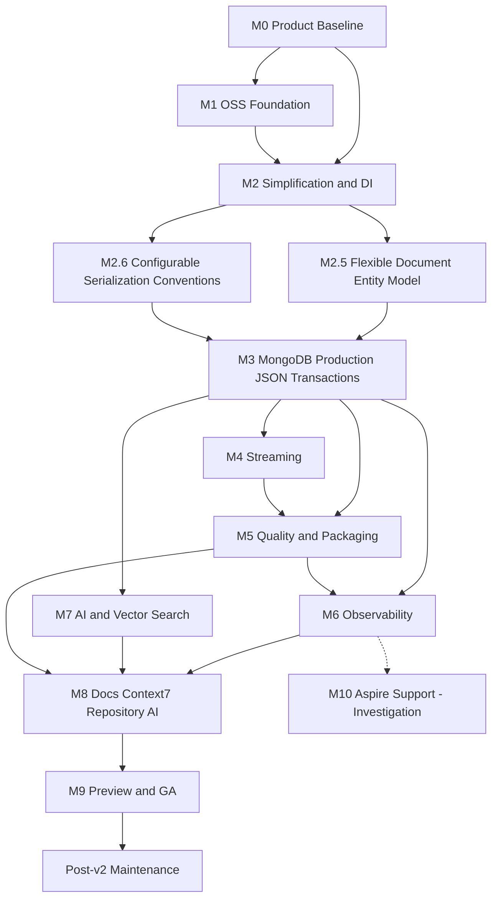

# Professional Open-Source v2 Roadmap

Canonical tracking for the **Dilcore MongoDB** toolkit v2.  
This document is the product roadmap. Implementation work is tracked as GitHub issues under the milestones below.

**Repository:** [Dilcore-Official/Dilcore-MongoDb](https://github.com/Dilcore-Official/Dilcore-MongoDb)  
**Issues filter:** [label:roadmap](https://github.com/Dilcore-Official/Dilcore-MongoDb/issues?q=is%3Aissue+label%3Aroadmap)  
**GitHub Project:** see [GitHub tracking](#github-tracking)  
**Status:** M3 provisioning runner (#22) stacked on repository correctness (#18).

---

## Product definition

### Clear value

Position the library as an **opinionated MongoDB application toolkit**, not a replacement for `MongoDB.Driver` and not a database-agnostic repository:

- Safe, validated multi-cluster / multi-database DI with runtime tenant-aware namespace resolution.
- Reusable document policies: optimistic concurrency, audit timestamps, optional soft delete, and typed failures.
- Declarative, idempotent collection / schema / index provisioning outside request hot paths.
- First-class dynamic and typed JSON interchange through System.Text.Json and Newtonsoft.Json without bypassing database / collection resolution.
- Explicit multi-document transaction coordination with bounded client-side budgets, plus independent finite-query and change-stream APIs.
- Production defaults and diagnostics through .NET logging, tracing, metrics, readiness, and MongoDB driver events.
- AI-ready integration through native MongoDB Vector Search and standard .NET embedding / vector abstractions.
- Direct `IMongoClient`, `IMongoDatabase`, and `IMongoCollection<T>` escape hatches for all driver capabilities.

This is better than repeating those cross-cutting policies in every service. It is **not** better for a simple application that only needs one client and a few direct collection calls.

### Explicit non-goals

- Do not reimplement connection pooling, retryable reads/writes, concerns, transaction retry semantics, cursor protocols, aggregation, GridFS, encryption, or exporters already supplied by MongoDB / .NET ecosystems. Transaction and streaming features must remain thin, explicit coordination layers over driver sessions / cursors.
- Do not hide MongoDB query types behind a lowest-common-denominator data abstraction.
- Do not add Azure Monitor, Application Insights, AWS, ADOT, CloudWatch, OpenAI, or other vendor SDKs to core packages.
- Do not promise provider neutrality while MongoDB is the only backend. **Accepted ([ADR 0001](docs/adr/0001-package-naming.md)):** rename packages to `Dilcore.MongoDB` (hard break; no shims) and address Amazon DocumentDB confusion in docs.

### Design principles

- Thin integration over `MongoDB.Driver`; advanced features remain directly reachable.
- Startup configuration is immutable and validated; request / tenant namespace resolution is scoped and fail-closed.
- Singleton `IMongoClient` per unique cluster settings; lightweight database / collection handles use appropriate scoped or singleton lifetimes.
- Optional policies are expressed through composable interfaces rather than one mandatory entity shape.
- JSON adapters share one conversion contract, preserve BSON types through Extended JSON or explicit conversion profiles, and use the same named binding / namespace resolver pipeline as typed documents.
- Transaction state and cursor ownership are explicit; no ambient session, hidden transaction, parallel transaction operation, silent atomicity-breaking chunk, or undisposed cursor.
- Telemetry is passive, opt-in, exporter-neutral, redacted, and low-cardinality.
- No side effects such as convention or index registration occur during ordinary collection resolution.

---

## Milestone dependency graph

**Release gates**

| Gate | Blocks | Criteria |
|------|--------|----------|
| Decisions | Package / API implementation | M0/M1 naming, SemVer, license, Dependabot, Serena baseline |
| Preview | `2.0.0-alpha` | Correctness, DI isolation, JSON fidelity, transaction safety, cursor lifecycle |
| GA | `2.0.0` | All M2–M8 exit criteria, Context7, skill, samples, migration docs |

---

## Milestones

### M0 — Product baseline and decisions

Milestone: [M0 Product Baseline](https://github.com/Dilcore-Official/Dilcore-MongoDb/milestone/1)

| Issue | Work | Priority |
|-------|------|----------|
| [#2](https://github.com/Dilcore-Official/Dilcore-MongoDb/issues/2) | Inventory public API and four-package graph; create API compatibility baseline — [docs/api/v1-public-api.md](docs/api/v1-public-api.md), `src/*/PublicAPI.*.txt` | P0 |
| [#3](https://github.com/Dilcore-Official/Dilcore-MongoDb/issues/3) | Record defects and incorrect positioning claims — [docs/product/v1-defects.md](docs/product/v1-defects.md) | P0 |
| [#4](https://github.com/Dilcore-Official/Dilcore-MongoDb/issues/4) | ADR: package naming — [docs/adr/0001-package-naming.md](docs/adr/0001-package-naming.md) (`Dilcore.MongoDB` + Abstractions) | P0 |
| [#5](https://github.com/Dilcore-Official/Dilcore-MongoDb/issues/5) | TFMs / matrix / SemVer / migration — [docs/policies/versioning-and-support.md](docs/policies/versioning-and-support.md); CI SDK → 10.0.x | P0 |
| [#6](https://github.com/Dilcore-Official/Dilcore-MongoDb/issues/6) | Measurable goals — [docs/product/v2-goals.md](docs/product/v2-goals.md) | P1 |
| [#7](https://github.com/Dilcore-Official/Dilcore-MongoDb/issues/7) | Serena `.serena/project.yml`, onboarding, focused memories | P1 |
| [#46](https://github.com/Dilcore-Official/Dilcore-MongoDb/issues/46) | Roadmap cross-link and coverage verification — `./scripts/verify-roadmap-coverage.sh` | P0 |

**M0 decisions recorded**

- Rename to `Dilcore.MongoDB` / `Dilcore.MongoDB.Abstractions`; two-package core goal; no v1 compatibility shims.
- TFM `net10.0`; MongoDB.Driver pin lives in `Directory.Packages.props`; server support = the pinned driver’s published range (see [versioning and support](docs/policies/versioning-and-support.md)).
- Balanced budgets: ≥80% line / ≥70% branch coverage; telemetry ≤1% disabled / ≤3% enabled; cold-start regression ≤5%.

**Exit criteria:** Naming ADR accepted; supported matrix published; API baseline captured; Serena memories committed (local overrides remain untracked).

### M1 — Open-source trust foundation

Milestone: [M1 OSS Foundation](https://github.com/Dilcore-Official/Dilcore-MongoDb/milestone/2)

| Issue | Work | Priority |
|-------|------|----------|
| [#8](https://github.com/Dilcore-Official/Dilcore-MongoDb/issues/8) | MIT license text + CONTRIBUTING, CoC, SECURITY, SUPPORT, GOVERNANCE, CHANGELOG | P0 |
| [#9](https://github.com/Dilcore-Official/Dilcore-MongoDb/issues/9) | Issue/PR templates, CODEOWNERS, Discussions policy, branch rulesets with CI required | P0 |
| [#10](https://github.com/Dilcore-Official/Dilcore-MongoDb/issues/10) | Dependabot for NuGet and GitHub Actions (weekly, bounded PRs, conservative grouping) | P0 |
| [#11](https://github.com/Dilcore-Official/Dilcore-MongoDb/issues/11) | Dependency review, CodeQL, Scorecard, SHA-pinned actions, workflow YAML validation | P0 |

**Exit criteria:** Trust docs landed; Dependabot validates for both ecosystems; security workflows green; CI is a required check.

### M2 — Simplify packages and redesign DI

Milestone: [M2 Simplification & DI](https://github.com/Dilcore-Official/Dilcore-MongoDb/milestone/3)

| Issue | Work | Priority |
|-------|------|----------|
| [#12](https://github.com/Dilcore-Official/Dilcore-MongoDb/issues/12) | Package topology + canonical package descriptions (core + planned optional IDs) | P0 |
| [#13](https://github.com/Dilcore-Official/Dilcore-MongoDb/issues/13) | Remove dead APIs, redundant packages, FluentValidation single-guard usage | P0 |
| [#14](https://github.com/Dilcore-Official/Dilcore-MongoDb/issues/14) | Named/typed cluster, database, document bindings; multi-cluster singleton clients | P0 |
| [#15](https://github.com/Dilcore-Official/Dilcore-MongoDb/issues/15) | Scoped namespace-resolution pipeline; app-owned dynamic prefixes (no first-class tenant types) | P0 |
| [#16](https://github.com/Dilcore-Official/Dilcore-MongoDb/issues/16) | External client ownership; keyed/typed driver escape hatches | P1 |
| [#17](https://github.com/Dilcore-Official/Dilcore-MongoDb/issues/17) | DI acceptance tests (clusters, same-type bindings, tenants, resolver order, v1 parity) | P0 |
| [#54](https://github.com/Dilcore-Official/Dilcore-MongoDb/issues/54) | Architecture tests (package topology, dependency/namespace/public-API/DI boundaries) | P0 |

**Package descriptions (canonical):** [docs/product/package-descriptions.md](docs/product/package-descriptions.md)

| NuGet ID | Status | PackageDescription (summary) |
|----------|--------|------------------------------|
| `Dilcore.MongoDB.Abstractions` | Core (M2) | Contracts, entity/policy abstractions, MongoDB-facing interfaces without DI host wiring |
| `Dilcore.MongoDB` | Core (M2) | Opinionated MongoDB toolkit: DI, namespace resolution, repositories, policies, driver escape hatches |
| `Dilcore.MongoDB.SystemTextJson` | Planned M3 | System.Text.Json adapters with Extended JSON fidelity + shared resolvers |
| `Dilcore.MongoDB.NewtonsoftJson` | Planned M3 | Newtonsoft.Json adapters (optional; never forced on STJ consumers) |
| `Dilcore.MongoDB.OpenTelemetry` | Planned M6 | OTEL source/meter registration helpers; exporters stay host-owned |
| `Dilcore.MongoDB.VectorData` | Planned M7 | Vector Search helpers; embeddings remain app-owned via MEAI |
| Streaming | M4 decision (#24) | Prefer in-core opt-in APIs; split package only if dependency lifecycle requires it |

**Exit criteria:** No unkeyed same-type collisions; duplicate registrations fail at startup; JSON and typed APIs share one resolver path; DI suite green; architecture tests green; core `PackageDescription` values match the package-descriptions catalog.

### M2.5 — Flexible document entity model

Milestone: [M2.5 Flexible Document Entity Model](https://github.com/Dilcore-Official/Dilcore-MongoDb/milestone/13)

`IDocumentEntity` currently forces every document into one mandatory shape (`Guid Id`, `ETag`, `IsDeleted`, `CreatedAt`, `UpdatedAt`), even when a document only needs an identifier. This milestone decouples the identifier type and decomposes the remaining properties into optional, composable policy interfaces, fulfilling the existing design principle that "optional policies are expressed through composable interfaces rather than one mandatory entity shape" — while keeping the single generic-repository pattern (`IGenericRepository<TDocument>` and friends) that consumers already use.

| Issue | Work | Priority |
|-------|------|----------|
| [#60](https://github.com/Dilcore-Official/Dilcore-MongoDb/issues/60) | ADR: decouple document identifier type from `IDocumentEntity` | P0 |
| [#61](https://github.com/Dilcore-Official/Dilcore-MongoDb/issues/61) | Decompose `IDocumentEntity` into composable policy interfaces (ETag, soft delete, audit timestamps) | P0 |
| [#62](https://github.com/Dilcore-Official/Dilcore-MongoDb/issues/62) | Adapt generic repositories and collection factory to the composable document entity model | P0 |

**Exit criteria:** Documents can use any identifier type and opt into only the policies they need; generic repositories, collection factory, and `DocumentEntityExtensions` behave correctly for any subset of composed policies; this is a hard break with no v1 shims (per non-goals); public API baseline, README, and samples updated.

### M2.6 — Configurable serialization conventions

Milestone: [M2.6 Configurable Serialization Conventions](https://github.com/Dilcore-Official/Dilcore-MongoDb/milestone/14)

`MongoDbCollectionFactory.EnsureConventions` currently registers one hardcoded, process-wide BSON `ConventionPack` (enum-as-string, camelCase naming, ignore-null, ignore-extra-elements) with no way for a consumer to opt into enum-as-int or a different naming/null-handling policy. This milestone exposes those conventions as configuration on `AddMongoDb`/`IMongoDbBuilder`, keeping today's behavior as the default.

| Issue | Work | Priority |
|-------|------|----------|
| [#63](https://github.com/Dilcore-Official/Dilcore-MongoDb/issues/63) | Design configurable serialization convention surface (enum representation, naming, null/extra-element handling) | P0 |
| [#64](https://github.com/Dilcore-Official/Dilcore-MongoDb/issues/64) | Implement configurable convention registration in `MongoDbCollectionFactory` / `MongoDbBuilder` | P0 |
| [#65](https://github.com/Dilcore-Official/Dilcore-MongoDb/issues/65) | Document global serialization convention configuration and add sample usage | P1 |

**Exit criteria:** Enum representation (string vs int/other), naming convention, and null/extra-element handling are configurable per `AddMongoDb` call; unconfigured consumers keep today's defaults; conflicting registrations across multiple `AddMongoDb` calls fail fast at startup.

### M3 — MongoDB production, JSON, and transactions

Milestone: [M3 MongoDB Production, JSON & Transactions](https://github.com/Dilcore-Official/Dilcore-MongoDb/milestone/4)

| Issue | Work | Priority |
|-------|------|----------|
| [#18](https://github.com/Dilcore-Official/Dilcore-MongoDb/issues/18) | Fix latent correctness bugs (soft-delete, ETag, mutation, replace/patch, bulk) | P0 |
| [#19](https://github.com/Dilcore-Official/Dilcore-MongoDb/issues/19) | Production query/policy capabilities (keyset pagination, restore/purge, typed failures) | P1 |
| [#20](https://github.com/Dilcore-Official/Dilcore-MongoDb/issues/20) | JSON interoperability: STJ + Newtonsoft, Extended JSON fidelity, conversion profiles | P0 |
| [#21](https://github.com/Dilcore-Official/Dilcore-MongoDb/issues/21) | Multi-document transactions via `WithTransactionAsync` + client budget guardrails | P0 |
| [#22](https://github.com/Dilcore-Official/Dilcore-MongoDb/issues/22) | Idempotent provisioning / migration runner (indexes, TTL, vector, schema validation) | P0 |
| [#23](https://github.com/Dilcore-Official/Dilcore-MongoDb/issues/23) | Replica-set integration matrix + production security guidance | P0 |

**Exit criteria:** Soft-delete/concurrency/bulk correct; both JSON stacks round-trip with type fidelity; transactions never silently chunk; budgets are estimates (no false “16 MiB total transaction” claim); provisioning is outside request hot paths.

### M4 — Streaming as an independent feature

Milestone: [M4 Streaming](https://github.com/Dilcore-Official/Dilcore-MongoDb/milestone/5)

| Issue | Work | Priority |
|-------|------|----------|
| [#24](https://github.com/Dilcore-Official/Dilcore-MongoDb/issues/24) | Streaming surface design (in-core vs package; update [package-descriptions](docs/product/package-descriptions.md)) | P0 |
| [#25](https://github.com/Dilcore-Official/Dilcore-MongoDb/issues/25) | Finite query streaming (`IAsyncEnumerable<T>`, disposal, backpressure) | P0 |
| [#26](https://github.com/Dilcore-Official/Dilcore-MongoDb/issues/26) | Change streams (resume tokens, checkpoints, at-least-once docs) | P0 |
| [#27](https://github.com/Dilcore-Official/Dilcore-MongoDb/issues/27) | Streaming tests + bounded lifecycle telemetry hooks | P1 |

**Exit criteria:** Finite and change streams are non-interchangeable; every enumeration owns/disposes one cursor; no unbounded buffering or infinite auto-retry; same resolver pipeline as CRUD/JSON.

### M5 — Quality, compatibility, and packaging

Milestone: [M5 Quality & Packaging](https://github.com/Dilcore-Official/Dilcore-MongoDb/milestone/6)

| Issue | Work | Priority |
|-------|------|----------|
| [#28](https://github.com/Dilcore-Official/Dilcore-MongoDb/issues/28) | `global.json`, `.editorconfig`, analyzers, XML docs, warnings-as-errors, format gate | P0 |
| [#29](https://github.com/Dilcore-Official/Dilcore-MongoDb/issues/29) | Consolidate tests on NUnit + Shouldly; expand unit/integration/public-API suites | P0 |
| [#30](https://github.com/Dilcore-Official/Dilcore-MongoDb/issues/30) | Package validation, Source Link, symbols, OIDC NuGet publish; `PackageDescription`/tags match [package-descriptions](docs/product/package-descriptions.md) | P0 |
| [#31](https://github.com/Dilcore-Official/Dilcore-MongoDb/issues/31) | Benchmarks: initial suite (cold-start, CRUD, bulk, projections) in CI with non-blocking PR comments; telemetry / JSON / transactions / streaming overhead still pending M3–M6 | P1 |

**Exit criteria:** Deterministic builds; package validation green; main-branch auto-publish removed; Shouldly remains the assertion library.

### M6 — Exporter-neutral observability

Milestone: [M6 Observability](https://github.com/Dilcore-Official/Dilcore-MongoDb/milestone/7)

| Issue | Work | Priority |
|-------|------|----------|
| [#32](https://github.com/Dilcore-Official/Dilcore-MongoDb/issues/32) | Upgrade MongoDB.Driver (3.7+ ActivitySource; validate current release) | P0 |
| [#33](https://github.com/Dilcore-Official/Dilcore-MongoDb/issues/33) | Core OTEL: `ILogger` / `ActivitySource` / `Meter`; no exporter dependencies | P0 |
| [#34](https://github.com/Dilcore-Official/Dilcore-MongoDb/issues/34) | Metrics, redaction, health readiness; transaction/stream metric dimensions | P0 |
| [#35](https://github.com/Dilcore-Official/Dilcore-MongoDb/issues/35) | Host samples: OTLP/Aspire, Azure Monitor/App Insights, AWS CloudWatch via ADOT | P1 |

**Exit criteria:** No listeners ⇒ near-zero overhead; no duplicate driver spans; App Insights and CloudWatch consume the same sources by changing only host export config.

### M7 — MongoDB AI and vector search

Milestone: [M7 AI & Vector Search](https://github.com/Dilcore-Official/Dilcore-MongoDb/milestone/8)

| Issue | Work | Priority |
|-------|------|----------|
| [#36](https://github.com/Dilcore-Official/Dilcore-MongoDb/issues/36) | ADR/spike: driver, MEAI, VectorData, SK connector, `mongo-mevd-provider` | P0 |
| [#37](https://github.com/Dilcore-Official/Dilcore-MongoDb/issues/37) | Native vector-index lifecycle and `$vectorSearch` policy integration | P0 |
| [#38](https://github.com/Dilcore-Official/Dilcore-MongoDb/issues/38) | Embedding interoperability + semantic/hybrid/RAG samples (no secrets) | P1 |

**Exit criteria:** No competing general vector-store abstraction; embedding models remain app-owned; Atlas-local or MongoDB Search tests cover happy path.

### M8 — Documentation, Context7, and repository AI adoption

Milestone: [M8 Docs, Context7 & Repository AI](https://github.com/Dilcore-Official/Dilcore-MongoDb/milestone/9)

| Issue | Work | Priority |
|-------|------|----------|
| [#39](https://github.com/Dilcore-Official/Dilcore-MongoDb/issues/39) | README + structured `docs/` overhaul with tested snippets | P0 |
| [#40](https://github.com/Dilcore-Official/Dilcore-MongoDb/issues/40) | `context7.json` + `context7-refresh.yml` for `/dilcore-official/dilcore-mongodb` | P0 |
| [#41](https://github.com/Dilcore-Official/Dilcore-MongoDb/issues/41) | Hierarchical `AGENTS.md` (root, src, test, samples, per-project) | P0 |
| [#42](https://github.com/Dilcore-Official/Dilcore-MongoDb/issues/42) | Consumer skill `.cursor/skills/using-dilcore-mongodb/` | P0 |

**Exit criteria:** Context7 indexes consumer docs only (excludes `AGENTS.md` / skills); skill and AGENTS responsibilities stay separate; representative Context7 queries succeed after refresh.

### M9 — v2 preview, GA, and adoption

Milestone: [M9 v2 Preview & GA](https://github.com/Dilcore-Official/Dilcore-MongoDb/milestone/10)

| Issue | Work | Priority |
|-------|------|----------|
| [#43](https://github.com/Dilcore-Official/Dilcore-MongoDb/issues/43) | Publish `2.0.0-alpha`; external consumer/API/package/telemetry validation | P0 |
| [#44](https://github.com/Dilcore-Official/Dilcore-MongoDb/issues/44) | Freeze API and publish `2.0.0` when all GA exit criteria pass | P0 |

**Exit criteria:** Alpha feedback incorporated; GA checklist complete; Post-v2 Maintenance milestone open with ownership.

### Post-v2 Maintenance

Milestone: [Post-v2 Maintenance](https://github.com/Dilcore-Official/Dilcore-MongoDb/milestone/11)

| Issue | Work | Priority |
|-------|------|----------|
| [#45](https://github.com/Dilcore-Official/Dilcore-MongoDb/issues/45) | Post-GA maintenance backlog: support matrix, SLAs, Dependabot cadence, upstream tracking | P1 |

Ongoing: supported versions, upstream driver / VectorData changes, dependency cadence (Dependabot), issue / security SLAs, benchmarks, deprecation windows, telemetry semantic-convention changes, and adoption feedback.

### M10 — .NET Aspire support (investigation) — `to-be-investigated`

Milestone: [M10 Aspire Support (Investigation)](https://github.com/Dilcore-Official/Dilcore-MongoDb/milestone/12)

Not yet scoped or scheduled; not a dependency for Preview or GA. Tracked as a spike to decide whether/how Dilcore.MongoDB should integrate with [.NET Aspire](https://learn.microsoft.com/dotnet/aspire/) (AppHost resource wiring, `ServiceDefaults`/health-check interop, connection-string/service-discovery alignment with the M2 DI model), and whether the result belongs in core or a new `Dilcore.MongoDB.Aspire` package.

| Issue | Work | Priority |
|-------|------|----------|
| [#59](https://github.com/Dilcore-Official/Dilcore-MongoDb/issues/59) | Investigate .NET Aspire integration; record decision on scope and package placement | P2 |

**Exit criteria:** Decision recorded (in-core, new package, or no-go); if accepted, follow-up implementation issues filed and this milestone's label changes from `to-be-investigated`.

---

## Preview and GA exit criteria

### Preview (`2.0.0-alpha`)

- [ ] M0 naming / matrix decisions accepted ([#4](https://github.com/Dilcore-Official/Dilcore-MongoDb/issues/4), [#5](https://github.com/Dilcore-Official/Dilcore-MongoDb/issues/5))
- [ ] M1 trust foundation and Dependabot live ([#8](https://github.com/Dilcore-Official/Dilcore-MongoDb/issues/8)–[#11](https://github.com/Dilcore-Official/Dilcore-MongoDb/issues/11))
- [ ] M2 DI isolation suite green ([#17](https://github.com/Dilcore-Official/Dilcore-MongoDb/issues/17))
- [ ] M3 correctness, JSON fidelity, transaction safety green ([#18](https://github.com/Dilcore-Official/Dilcore-MongoDb/issues/18), [#20](https://github.com/Dilcore-Official/Dilcore-MongoDb/issues/20), [#21](https://github.com/Dilcore-Official/Dilcore-MongoDb/issues/21))
- [ ] M4 cursor lifecycle / disposal green ([#25](https://github.com/Dilcore-Official/Dilcore-MongoDb/issues/25)–[#27](https://github.com/Dilcore-Official/Dilcore-MongoDb/issues/27))
- [ ] Package builds with Source Link and validation ([#30](https://github.com/Dilcore-Official/Dilcore-MongoDb/issues/30))

### GA (`2.0.0`)

- [ ] All M2–M8 acceptance criteria satisfied
- [ ] Context7 refresh works on `main` ([#40](https://github.com/Dilcore-Official/Dilcore-MongoDb/issues/40))
- [ ] Consumer skill validated against CRUD, JSON, DI, transactions, streaming, telemetry, vector scenarios ([#42](https://github.com/Dilcore-Official/Dilcore-MongoDb/issues/42))
- [ ] `AGENTS.md` hierarchy inheritance-safe and linted ([#41](https://github.com/Dilcore-Official/Dilcore-MongoDb/issues/41))
- [ ] Migration guide for v1 consumers published ([#39](https://github.com/Dilcore-Official/Dilcore-MongoDb/issues/39), [#44](https://github.com/Dilcore-Official/Dilcore-MongoDb/issues/44))
- [ ] NuGet.org OIDC trusted publishing and GitHub Release automation proven on a dry run ([#30](https://github.com/Dilcore-Official/Dilcore-MongoDb/issues/30))

---

## GitHub tracking

| Artifact | Location |
|----------|----------|
| Labels | `area:*`, `priority:P0/P1/P2`, `type:decision/feature/bug/docs/chore/breaking`, `roadmap`, `to-be-investigated` |
| Milestones | [M0–M9 + Post-v2 Maintenance + M2.5 Flexible Document Entity Model + M2.6 Configurable Serialization Conventions + M10 Aspire (investigation)](https://github.com/Dilcore-Official/Dilcore-MongoDb/milestones) |
| Project | **Dilcore MongoDB v2 Roadmap** — create/link if missing (requires `project` token scope); views: milestone roadmap, current iteration, blockers, post-v2 backlog |
| Issues | [#2](https://github.com/Dilcore-Official/Dilcore-MongoDb/issues/2)–[#46](https://github.com/Dilcore-Official/Dilcore-MongoDb/issues/46) (roadmap-labeled); coverage verification [#46](https://github.com/Dilcore-Official/Dilcore-MongoDb/issues/46); [#59](https://github.com/Dilcore-Official/Dilcore-MongoDb/issues/59)–[#65](https://github.com/Dilcore-Official/Dilcore-MongoDb/issues/65) track the M10 Aspire investigation, M2.5 entity model, and M2.6 serialization convention work separately (not yet in the enforced coverage range) |

### Owner actions outside automation

1. Enable Dependabot security updates and dependency graph / alerts in repository settings ([#10](https://github.com/Dilcore-Official/Dilcore-MongoDb/issues/10)).
2. Create the GitHub Project **Dilcore MongoDB v2 Roadmap**, add views (milestone roadmap, current iteration, blockers, post-v2 backlog), and attach all `roadmap`-labeled issues if automation lacked `project` / `read:project` scopes.
3. Create / claim Context7 library key and store `CONTEXT7_API_KEY` as a repository secret when [#40](https://github.com/Dilcore-Official/Dilcore-MongoDb/issues/40) executes (library ID will follow MongoDB naming).
4. Configure NuGet.org OIDC trusted publishing when [#30](https://github.com/Dilcore-Official/Dilcore-MongoDb/issues/30) publishing work begins.
5. Reserve/claim NuGet.org IDs `Dilcore.MongoDB` and `Dilcore.MongoDB.Abstractions` on first publish ([#4](https://github.com/Dilcore-Official/Dilcore-MongoDb/issues/4)).

### Label catalog

| Label | Purpose |
|-------|---------|
| `area:product` | Product positioning and scope |
| `area:api` | Public API surface |
| `area:di` | Dependency injection |
| `area:tenancy` | Namespace resolution (app-owned async prefix resolvers / contributors) |
| `area:mongodb` | MongoDB driver integration |
| `area:json` | JSON interoperability |
| `area:serialization` | BSON / serializer conventions |
| `area:transactions` | Multi-document transactions |
| `area:streaming` | Finite query streaming |
| `area:change-streams` | Change streams |
| `area:migrations` | Provisioning / migrations |
| `area:observability` | Logging, tracing, metrics |
| `area:vector-search` | Vector / AI search |
| `area:docs` | Documentation |
| `area:agents` | Repository `AGENTS.md` |
| `area:skill` | Consumer Cursor skill |
| `area:ci` | CI workflows |
| `area:dependencies` | Dependabot / dependency policy |
| `area:packaging` | NuGet packaging / publishing |
| `area:security` | Security / Scorecard / secrets |
| `area:tooling` | Serena, analyzers, editorconfig |
| `area:community` | Templates, CoC, governance |
| `area:aspire` | .NET Aspire integration |
| `priority:P0` | Blocks preview / GA |
| `priority:P1` | Required for quality GA |
| `priority:P2` | Nice-to-have / post-GA |
| `type:decision` | ADR / decision |
| `type:feature` | New capability |
| `type:bug` | Defect fix |
| `type:docs` | Documentation |
| `type:chore` | Tooling / maintenance |
| `type:breaking` | Breaking change |
| `roadmap` | v2 roadmap tracked work |
| `to-be-investigated` | Needs a spike/decision before scoping; not yet committed |

---

## Coverage matrix

| Theme | Issues |
|-------|--------|
| Product / decisions | #2–#6, #12, #24, #36, #46, #54 |
| DI / tenancy | #14–#17, #15, #54 |
| Document entity model | #60–#62 |
| Serialization conventions | #63–#65 |
| JSON / serialization | #20 |
| Transactions | #21 |
| Streaming / change streams | #24–#27 |
| MongoDB correctness / migrations | #18, #19, #22, #23 |
| Observability | #32–#35, #27, #34 |
| Vector / AI | #36–#38 |
| Dependabot / dependencies | #10, #11, #32 |
| Docs / Context7 / AGENTS / skill | #39–#42 |
| Packaging / GA | #12 (descriptions), #28–#31, #43–#45 |
| Serena / tooling | #7, #28 |
| Aspire (investigation) | #59 |

---

## Verification checklist

- [x] Roadmap states why the library exists, when direct `MongoDB.Driver` is preferable, and what will not be reimplemented.
- [x] Every roadmap work item links to a GitHub issue with milestone, `area:*`, `type:*`, `priority:*`, `roadmap`, a Dependencies section, non-empty acceptance-criteria checklist items, and a ROADMAP.md link (enforced by `scripts/verify-roadmap-coverage.sh`).
- [x] Dependabot plan covers NuGet and GitHub Actions (not arbitrary YAML keys) — [#10](https://github.com/Dilcore-Official/Dilcore-MongoDb/issues/10).
- [x] DI, JSON, transaction, streaming, observability, vector, Context7, AGENTS, and skill requirements are represented as issues.
- [ ] GitHub Project **Dilcore MongoDB v2 Roadmap** created and issues attached (owner action if token lacks `project` scope).
- [x] M0 baseline docs/tooling landed (`docs/`, Serena memories, CI SDK 10.0.x); package/API renames remain M2+.
- [x] Coverage verification script: [`scripts/verify-roadmap-coverage.sh`](scripts/verify-roadmap-coverage.sh).
